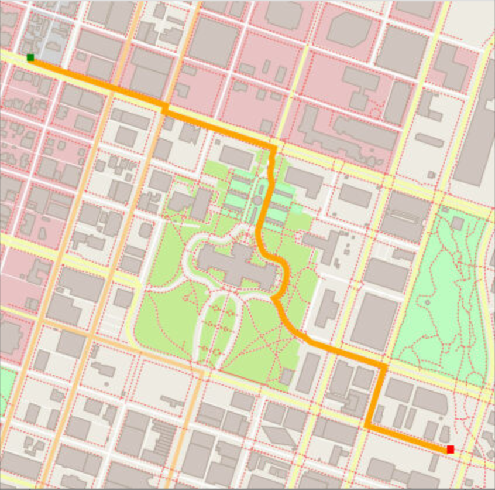

# C++ OpenStreetMap Route Planning Project

This repo contains the code for a Route Planning project using OpenStreetMaps and C++.



## Why
What do an Amazon delivery, searching relatives in the Kennedy family tree, and someone using Google Maps to go from A to B have in common? If you think about these problems from a Computer Science perspective, they involve route planning and path search. Fascinating, isn't it? If you are curious to know how one might solve these tasks via the renown A* (pronounced "A-start") search algorithm, then you have come to the right place. This repository will show how to access OpenStreetMap data, finding the shortest path from coordinates on a map and display them - all written in C++.

## How
The A* algorithm is quite similar to other search algorithms you might have seen before, such as breadth-first search (BFS), except for the additional step of computing a heuristic and using that heuristic (in addition to the cost) to find the next node. The following is psuedocode for the algorithm. Although the pseudocode shows the complete algorithm in a single function, we will split parts of the algorithm into separate functions in the code:

```
Search(grid, initial_point, goal_point):
	* Initialize an empty list of open nodes
	* Initialize a starting node with the following:
		* x and y values given by initial_point
		* g = 0, where g is the cost for each move
		* h given by the heuristic function (a function of the current coordinates 
		  and the goal, e.g. imagine the air distance)
	
	* Add the new node to the list of open nodes.
	* while the list of open nodes is not empty, do:
		* Sort the open list by f-value  (g + h aka lowest total cost + heuristic)
		* Pop the optimal node (called the current node).
		* Mark the node's coordinates in the grid as part of the path.
		
		* if the current node is the goal node:
			* return the grid
		* else, expand the search to the current node's neighbors:
			* Check each neighbor node in the grid to ensure that the node is empty
			* That it hasn't been closed and is not an obstacle
			* If the node is empty, compute the cost (g) and the heuristic (h)
			* Add node to the list of open nodes
			* Mark the cell as closed
	* If you exit the while loop because the list of open nodes is empty, 
	  you have run out of new nodes to explore and haven't found a path.
```

For further details, refer to the paper by [Hart, Nielsson and Raphael (1968), _A Formal Basis for the Heuristic Determination of Minimum Cost Paths_](https://ieeexplore.ieee.org/document/4082128) or the implementation in `/src/route_planner.cpp`.

## What
Up next you find instructions for cloning this repository, installing the necessary dependencies, compiling via cmake and make, testing and running the code. 

## Cloning

Make sure to clone the project using the `--recurse-submodules` flag. This will install the necessary submodules located in `/thirdparty` and checkout the commits used for this project.
```
git clone https://github.com/ImmanuelXIV/AStar_Route_Planner.git --recurse-submodules
```

## Dependencies for Running Locally
* cmake >= 3.11.3
  * All OSes: [click here for installation instructions](https://cmake.org/install/)
* make >= 4.1 (Linux, Mac), 3.81 (Windows)
  * Linux: make is installed by default on most Linux distros
  * Mac: [install Xcode command line tools to get make](https://developer.apple.com/xcode/features/)
  * Windows: [Click here for installation instructions](http://gnuwin32.sourceforge.net/packages/make.htm)
* gcc/g++ >= 7.4.0
  * Linux: gcc / g++ is installed by default on most Linux distros
  * Mac: same instructions as make - [install Xcode command line tools](https://developer.apple.com/xcode/features/)
  * Windows: recommend using [MinGW](http://www.mingw.org/)
* IO2D
  * Installation instructions for all operating systems can be found [here](https://github.com/cpp-io2d/P0267_RefImpl/blob/master/BUILDING.md)
  * This library must be built in a place where CMake `find_package` will be able to find it

## Compiling and Running

### Compiling
To compile the project, first change into the cloned directory:
```
cd AStar_Route_Planner
```
Then create a `build` directory and change to that directory:
```
mkdir build
cd build
```
From within the `build` directory, run `cmake` and `make` as follows:
```
cmake ..
make
```
### Testing and Running
The executables will be placed in the `build` directory. From within `build`, you can test and run the project as follows.

#### Test
```
./test
```
This should show you the passed tests and the execution runtime.

#### Run
```
./OSM_A_star_search
```
Or to specify a map file:
```
./OSM_A_star_search -f ../<your_osm_file.osm>
```

### References
This project is part of the [Udacity C++ Nanodegree](https://www.udacity.com/course/c-plus-plus-nanodegree--nd213) curriculum. Thanks to to preoject instructors and code reviewers!


